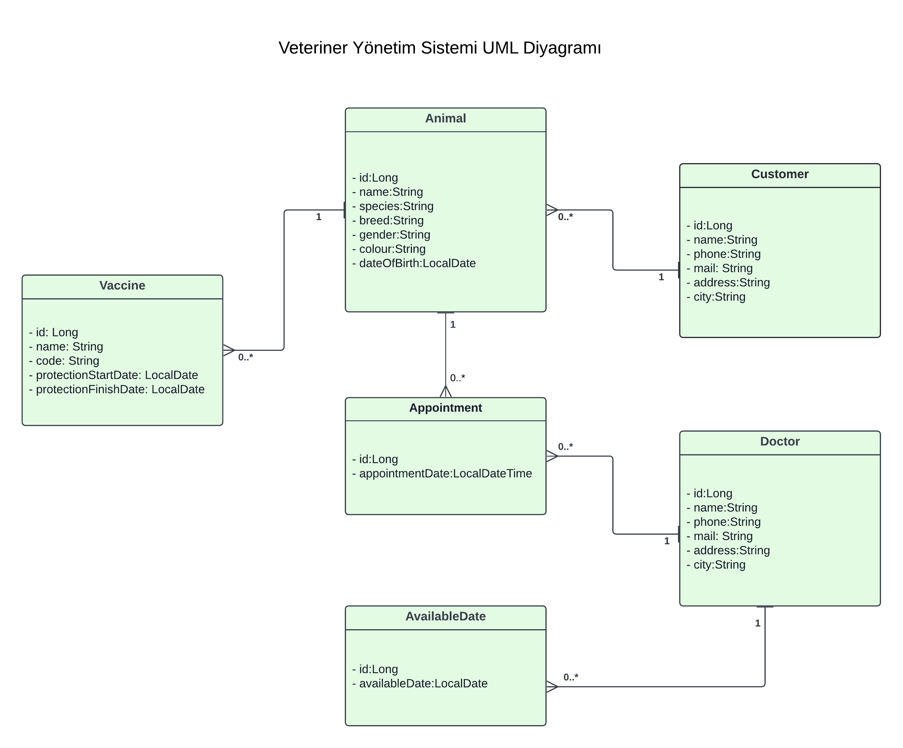
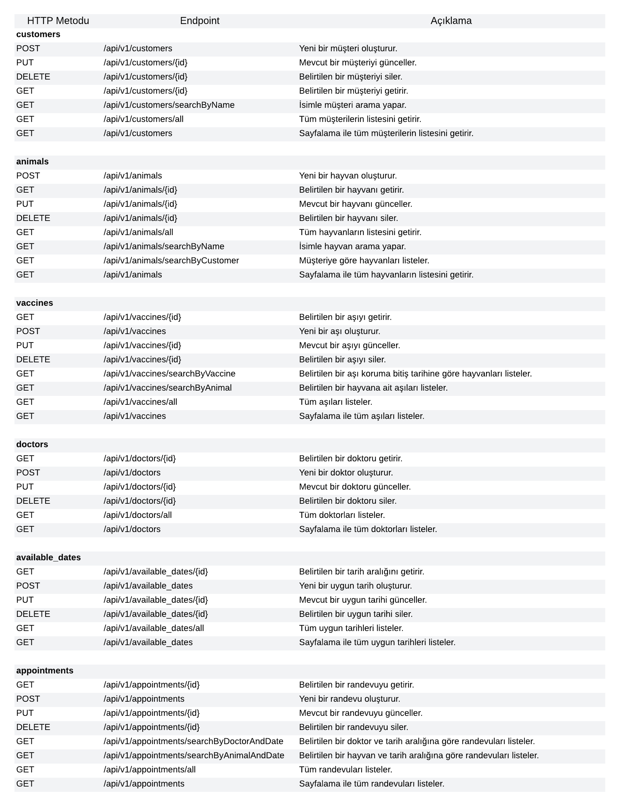

# Veteriner Yönetim Sistemi
Veteriner Yönetim Sistemi, veteriner kliniklerinin randevu, müsaitlik tarihleri, müşteri ve hayvan kayıtlarını yönetmelerine olanak tanıyan bir RESTful API'dir. Bu sistem, doktorlar, müşteriler ve hayvanlar için CRUD operasyonlarını destekler ve belirli kriterlere göre filtreleme yapılmasını sağlar.

### Kullanılan Teknolojiler
Java Spring Boot

Spring Data JPA

PostgreSQL

Spring Web   

### Ana Özellikler
Doktor Yönetimi: Doktorlar kaydedilebilir, güncellenebilir, silinebilir ve listelenebilir.

Müsaitlik Takvimi: Doktorların müsaitlik tarihleri kaydedilebili, güncellenebilir, silinebilir ve listelenebilir.

Hayvan Sahibi Yönetimi: Müşteriler kaydedilebilir, güncellenebilir, silinebilir ve listelenebilir.

Hayvan Yönetimi: Hayvanlar kaydedilebilir, güncellenebilir, silinebilir ve listelenebilir.

Aşı Yönetimi: Hayvanlara uygulanan aşılar kaydedilebilir, güncellenebilir, silinebilir ve listelenebilir.

Randevu Yönetimi: Hayvanlar için randevular oluşturulabilir, güncellenebilir, silinebilir ve listelenebilir. 

Filtreleme işlemleri yapılabilir.

### UML Diyagram
Aşağıda, sistemin temel bileşenleri ve aralarındaki ilişkileri gösteren UML diyagramı yer almaktadır:

### API Kullanımı ve Endpoint Listesi
Sistemin API endpoint'leri ve bunların kullanımı aşağıda yer alan görselde detaylandırılmıştır:

### Uygulama Başlatma Adımları

| Adım | Açıklama |
| --- | --- |
| 1 | Projeyi yerel makinenize klonlayın: `git clone https://github.com/kullaniciadi/veteriner-yonetim-sistemi.git` |
| 2 | Projeye PostgreSQL veya MySQL veritabanı bağlantısı yapın. Gerekli yapılandırmaları `application.properties` dosyasında yapın. |
| 3 | Projeyi derleyin ve çalıştırın: `cd veteriner-yonetim-sistemi/` ve `mvn spring-boot:run` |

### Lisans
`MIT`